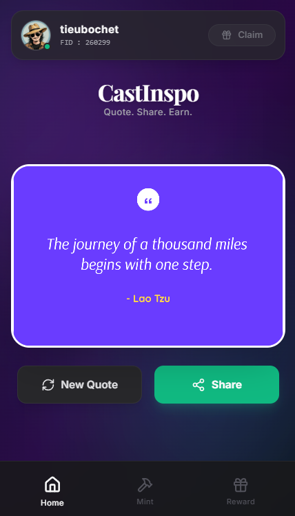

# CastInspo ✨

**CastInspo** is a Farcaster Frame (Mini App) that turns daily inspiration into on-chain rewards. Users can discover meaningful quotes, create unique digital collectibles, and compete on the global leaderboard on the **Base** network.



## 🌟 Key Features

### 1. Daily Inspiration
* **Quote Generator:** Displays a random or daily inspirational quote.
* **Dynamic Images:** Automatically generates beautiful, shareable quote images using HTML5 Canvas.

### 2. Gamification & Leaderboard
* **Daily Check-in:** Perform on-chain check-ins daily to earn reward points.
* **Global Leaderboard:** Real-time ranking system powered by Supabase to track top users.
* **User Levels:**
    * **Novice:** < 100 PTS
    * **Seeker:** 100 - 600 PTS
    * **Inspirator:** > 600 PTS

### 3. NFT Collectibles (Base Chain)
* **Genesis Badge:** Limited edition NFT (100 slots) for Early Adopters (+500 PTS).
* **Quote of the Day:** Users can Mint their favorite daily quotes as permanent NFTs (Open Edition) with dynamic metadata (+20 PTS per mint).

## 🏆 Scoring System

| Action | Points | Frequency |
| :--- | :--- | :--- |
| **Genesis Badge Owner** | **+500 PTS** | One-time |
| **Daily Check-in** | **+50 PTS** | Daily |
| **Mint Daily Quote** | **+20 PTS** | Unlimited |
| **Active User** | **+10 PTS** | Base score |

## 🛠 Tech Stack

* **Frontend:** React 19, Vite, TypeScript
* **Styling:** Tailwind CSS, Lucide React (Icons)
* **Blockchain:** `viem` (Base Mainnet Interaction)
* **Farcaster:** `@farcaster/frame-sdk`
* **Backend / Database:** Supabase (for Leaderboard & User Data)
* **Storage:** ImgBB (Images), IPFS (NFT Metadata)

## 🔗 Smart Contracts

The project interacts with the following contracts on **Base Mainnet (8453)**:

| Contract Name | Address | Description |
| :--- | :--- | :--- |
| **Daily Reward** | `0xcB517c1Ba4587a5192eB8D4f45e1f8617a47a90c` | Logic for daily check-in and claim tracking. |
| **Genesis NFT** | `0x831e3158f427eb74a7b02Fa40E40daA1a9111568` | Limited Edition Genesis Badge (ERC-721). |
| **Daily Quote NFT** | `0x0636503Eb16296bA79Bd4442098095656b0126CE` | Dynamic Metadata NFT for Daily Quotes (ERC-721). |

## 🚀 Installation & Setup

### Prerequisites
* Node.js (v18+)
* ImgBB API Key
* Supabase Project (URL & Anon Key)

### Steps

1.  **Clone the repository:**
    ```bash
    git clone https://github.com/tieubochet/cast-inspo.git
    cd cast-inspo
    ```

2.  **Install dependencies:**
    ```bash
    npm install
    ```

3.  **Configure Environment Variables:**
    Create a `.env` file in the root directory and add the following keys:
    ```env
    VITE_IMGBB_API_KEY=your_imgbb_api_key
    VITE_SUPABASE_URL=your_supabase_project_url
    VITE_SUPABASE_KEY=your_supabase_anon_key
    ```

4.  **Run Local Server:**
    ```bash
    npm run dev
    ```
    Access `http://localhost:5173` to view the app.

## 📱 Deployment

The project is optimized for deployment on **Vercel**.

1.  Push your code to GitHub.
2.  Import the project into Vercel.
3.  Add the Environment Variables (`VITE_IMGBB_API_KEY`, `VITE_SUPABASE_URL`, `VITE_SUPABASE_KEY`) in the Vercel Project Settings.
4.  Deploy!

## 📄 License

[MIT License](LICENSE) © 2025 0xteeboo